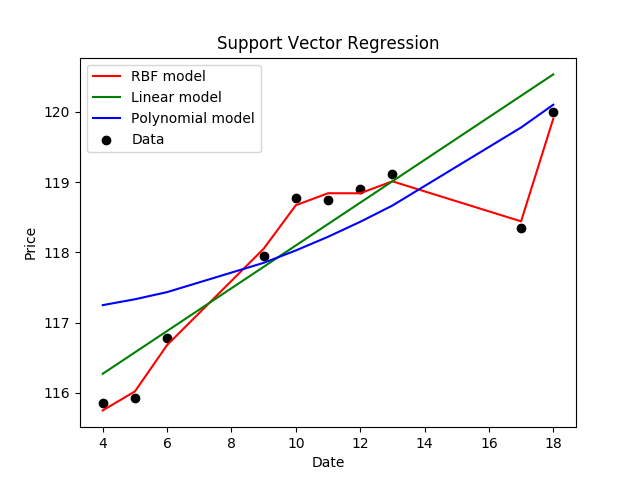

# Stock_Price_Predictor
This project allows users to predict stock prices through the use of [scikit-learn](https://scikit-learn.org/stable/) to train a support vector regression on a Google Finance dataset (apple in this case). The code produces a graph showing the 3 models used: RBF, Linear, and Polynomial (RBF turned out to be the best one). The Machine Learning model can be adjusted to [Keras](https://keras.io/), as well, to adapt it to Neural Networks. A further upgrade might be prediction of stock prices by using sentiment analysis and price history. 

## Output sample

